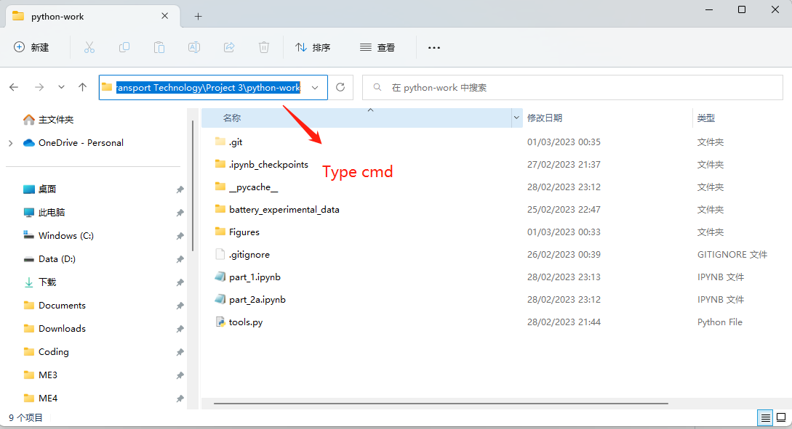

# modelling-of-lithium-ion-batteries
Imperial College London Mech Eng - Future Clean Transport Technology Project 3

## Fitted Functions for R0, R1 and C1 (updating continuously)

### Equation 1: First Order Gaussian Function for R1 (part 2a)

$R_1 = R_1^{0A}exp(-\frac{(I-b)^2}{c}) + d$

Fitted parameters:
- $R_1^{0A} = 0.15367552527467995$
- $b = -0.04587784742063004$
- $c = 0.39148540607499516 $
- $d = 0.008659593412853566$

### Equation 2: Arrhenius Equation for R0 (part 2b)

$R_0 = R_0^{T0}exp(-\frac{E}{R}(\frac{1}{T} - \frac{1}{T_0}))$
where $T$ and $T_0$ are in $K$!!!

Fitted parameters:
- $R_0^{T0} = 0.022130114077306542$
- $E = -18682.80693804173$

Constants:
- $R = 8.314$
- $T_0 = 293.15$

## First Order ECN Model

Model has been built. They shoule be easily accessible throughout the project. Check the function first_order_ECN() in [tools.py](tools.py) and the example at the last part of [part_2a.ipynb](part_2a.ipynb) for how to use it.

## Some Github Tips

For people feeling uncomfortable with Google Colab and don't have VS Code. This is for Windows only but for Mac it should be similar.

### Step 1 - Check if you have git downloaded

Open Command Prompt (terminal), type git. If there is an error, you need to download git (follow google instruction).

### Step 2 - Clone the repo from github to local

To do this you need to open the terminal and cd to the location where you want to put the folder on. For example, if I want to put it to my Desktop, I type:
```
cd C:\Users\fanyi\Desktop
```
But if you want to switch from C disk to D disk this doesn't work. In this case, do this first:
```
d:
```


There is an easier way for cd actually. Open the folder where you want to cd to, simply type cmd on the address bar:



So after you cd to the location where you want to put the folder on, run:
```
git clone https://github.com/sunfanyi/modelling-of-lithium-ion-batteries.git
```
You may need to login to your github account or something.

Done

### Step 3 - Check

Now you should have access to this github repo. For the following steps always make sure you have cd to the working directory (the folder of modelling-of-lithium-ion-batteries).

Type git log, if you see some commit history, it means you succeeded. Press q to exit.

### Step 4 - Push

After you have made some changes and want to make a commit, run:
```
git add .
```
don't miss the space between add and the dot. Then:
```
git commit -m "Your commit message."
git push
```
Now you should be able to see changes on github. There is a case when you can't push because you didn't pull the stuff, see next step.

### Step 5 - Pull

Whenever you see changes on github, pull it to your local by:
```
git pull
```
Be very careful about this because this will overwrite everything you wrote locally and uncommitted. So make copy before pull if necessary.

If you didin't pull and anyone made a new commit, you can never push. So everytime you want to do the project, go to github and check if there is anything you need to pull.

### Special case:

If two people are working simutaneously without telling each other. People A commit first. When people B want to commit, he won't be able to. He needs to pull it first but everything people B wrote will be overwritten.

In this case, we choose the most stupid method: people B make local copy of his changes, and then pull. Copy and paste his changes to the new version and push again.


